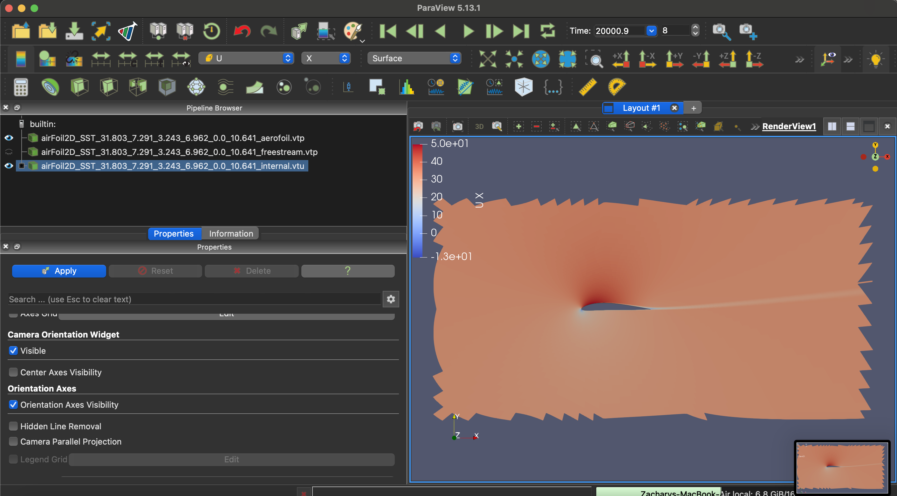
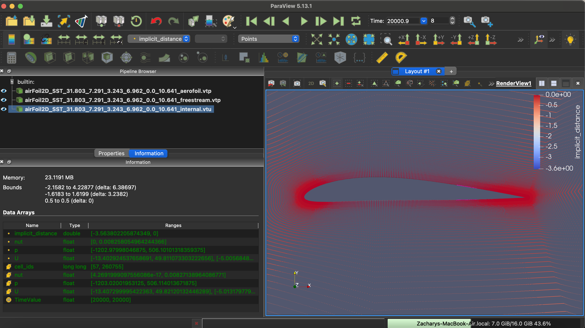

# airfRANS Dataset

## Usage
1. Install Dependencies
    `pip3 -r requirements.txt`
2. Run Script
    `python3 -m src.cli`
3. Run Tests
    `pytest test`

## My Approach
- Initial Research
    - Stumbled upon ParaView
        - Did some visualizations
        - Realized that we really only need to deal with *_internal.vtu
        - sdf is the `implicit_distance` field
        - U is velocity
        - x and y are in the point data section of the xml

Here are some images of paraview 

---

- Extracting Data
    - tried to use xml python lib
        - did not work, and didnt want to write custom VTK zlib decompression code
    - utilized pyvista to extract data
    - extracted data into a (N, 5) numpy array 
    - structure of numpy array:
        `(x, y, sdf, v_x, v_y)`
    - Extracted Number of Points using Regex

- Optimizing for memory constrained environments
    - Using h5d files for saving extracted numpy array
        - h5d is readily compatible with numpy
        - high performance for reading and writing
        - shrinks our dataset down to ~2GB
    - Incremental Writes to h5d file
        - we dont have to accumulate the entire dataset as a numpy array in memory
        - we can write a dataset from a `.vtu` file then close it, and extract another and so on
    - Incremental Reads in Pytorch Dataset
        - h5d uses mmapped files so we dont have to deal with loading the whole thing into ram
        - the pytorch dataset stores an index so we can just request a row from the h5 file
- CLI
    - start by downloading file
    - then extract from zip
    - then extract our relevant data and save to h5
    - then finally visuallize the statistics

- Usage in an ML Pipeline
    - Once the h5 file is downloaded
    - I created a Pytorch dataset class which can be used as a part of a training pipeline 
        - see `src/training/dataset.py`

## Next Steps
- Implementing a less naive way to calculate a running mean and running standard deviation
- Implement a torch dataloader
    - implementing a 80/20 split for training and evaluation data
- Improve testing
- Get feedback on cli usability
- Externalize file path parameters into a .env file
- Set up compute Infra
    - Is this being deployed to a cluster or a single beefy rig?
    - Is this being deployed to the cloud?
    - How are we gonna package this code?
